<br>

<p align="center">
  <picture>
    <source media="(prefers-color-scheme: dark)" srcset="docs/assets/daphnis-lockup-dark.svg">
    
  </picture>
</p>

English | [한국어](README.ko.md)

Turn one `.dap` text source into an animated SVG figure for documentation: structure, sequences, states, schemas, classes, traces, and charts, with values that change as dots arrive.

<p align="center">
  <picture>
    <source media="(prefers-color-scheme: dark)" srcset="docs/assets/showcase/async-orders-en-dark.svg">
    
  </picture>
</p>

Dots in a figure start at their own times and move at their own pace, so one scene shows several flows running at once, values changing as dots arrive, a queue filling, and a message lost on the way. A source declares cards (boxes, tables, APIs, classes, grids, charts, traces), picks how to view them (`graph`, `sequence`, `plot`, `time`), and then lists scenes. The same card can appear in several views, and one event moves it in all of them. daphnis measures text with the fonts it embeds, lays out with elkjs, checks the result for overlaps, and writes an animated SVG or an HTML player.

## How it works

```text
daphnis 2
title "Saturn"

person user "Developer"
group system "Saturn" direction=down {
  box tui "Screen"
  box engine "Engine"
}
external codex "Codex CLI"

user -> tui "input"
tui -> engine "JSON-RPC"
engine -> codex "app-server request"

view main graph right

scene "Chat" mode=once
  user -> tui "question"
  show tui "why does this test fail?" tag="you"
  tui -> engine
  engine -> codex "turn" time=3s
```

<picture>
  <source media="(prefers-color-scheme: dark)" srcset="docs/assets/how-it-works-dark.svg">
  
</picture>

1. The first line is the grammar version, `daphnis 2`. Then come cards and edges, a view, and scenes from `scene` on. A scene has one name and a `mode` of `static`, `once`, or `loop`; the explanation lives in the surrounding document, not in the figure.
2. daphnis lays out the cards inside `system` from top to bottom and the rest from left to right.
3. In the first beat a dot moves from `user` to `tui`, and the card inside `tui` fills in when the dot arrives.
4. A typo such as `engine -> cdex` stops the build with `how-it-works.dap:21: unknown card "cdex". Did you mean "codex"? Declared: codex, engine, main, system, tui, user`.

## Installation

Requirements: Node.js 20 or later.

```sh
npm install --save-dev daphnis
```

Run it with `npx daphnis <command>`.

## Gallery

<table>
  <tr>
    <td width="50%"><picture><source media="(prefers-color-scheme: dark)" srcset="docs/assets/showcase/order-rush-en-dark.svg"></picture><br>Simulation: concurrent flows and values that change. <a href="docs/reference/flow.md">Structure figures</a></td>
    <td width="50%"><picture><source media="(prefers-color-scheme: dark)" srcset="docs/assets/showcase/shop-schema-en-dark.svg"></picture><br>Schemas: tables, keys, and foreign keys. <a href="docs/reference/data.md">Data relation figures</a></td>
  </tr>
  <tr>
    <td width="50%"><picture><source media="(prefers-color-scheme: dark)" srcset="docs/assets/showcase/oauth-en-dark.svg"></picture><br>Sequence: messages in order. <a href="docs/reference/sequence.md">Sequence figures</a></td>
    <td width="50%"><picture><source media="(prefers-color-scheme: dark)" srcset="docs/assets/showcase/latency-en-dark.svg"></picture><br>Chart: a baseline and the improved value. <a href="docs/reference/charts.md">Charts</a></td>
  </tr>
  <tr>
    <td width="50%"><picture><source media="(prefers-color-scheme: dark)" srcset="docs/assets/showcase/cloud-architecture-en-dark.svg"></picture><br>Architecture: groups, icons, and numbered edges. <a href="docs/reference/architecture.md">Architecture</a></td>
    <td width="50%"><picture><source media="(prefers-color-scheme: dark)" srcset="docs/assets/showcase/order-state-en-dark.svg"></picture><br>State: states and the moves between them. <a href="docs/reference/state.md">State figures</a></td>
  </tr>
</table>

The [examples](examples/) folder holds one demo for each supported expression: the sixteen chart types, and architecture, flow, state, schema, class, API, sequence, trace, metric, memory, stack, queue, pointer, and one integration figure that connects a flow, an API, a schema, a metric, and a chart. `npm run catalog` renders all of them, with their sources, into `.local/examples/index.html`. The data in every example is made up to explain a feature.

## Usage

### Render one figure

Save the source from [How it works](#how-it-works) as `how-it-works.dap` and run:

```sh
npx daphnis render how-it-works.dap --html
```

```text
how-it-works.svg
how-it-works.html
```

The SVG animates without scripts and plays the first scene by its `mode`; `--scene 2` or `--scene "Chat"` picks another scene. The HTML adds scene tabs, download, fullscreen, and zoom (in fullscreen), and a scene never advances to the next one by itself. There are no play, pause, speed, or repeat buttons; each scene's `mode` decides how it plays. `--static` writes a still SVG of the chosen scene's last state: no dots or pulses, values, cards, and charts at their final state, and any `light` the scene left on. A document without scenes is a still figure that shows the values it declares. An animated SVG used as an `` cannot honor `prefers-reduced-motion` in Chrome; inline it, open it directly, or use `<picture>` with a `media` source that points to the `--static` SVG.

### Check a figure

```sh
npx daphnis check how-it-works.dap --strict --json
```

The command prints nothing and exits with 0 when the figure has no errors or warnings. `--strict` fails on warnings. `--json` prints one `{ file, line, message, severity, code, column }` object per diagnostic. A figure that would generate more than a budget allows (for example a grid with hundreds of thousands of cells) fails with a `budget-exceeded` error before any file is written; `--budget grid-elements=2000000` raises it, and `render`, `check`, `gallery`, and `md` all take `--budget name=value`.

### Keep figures in a Markdown document

Write the source in a `dap` code block and run `daphnis md`:

````text
```dap name=request
daphnis 2
box client "Client"
box server "Server"
client -> server "GET /orders"
```
````

```sh
npx daphnis md guide.md
```

The command writes `guide-request.svg` next to the document and puts `<!-- dap -->` right below the block. The alt text is the block's `title`, or its name when there is no title. Run it again and nothing changes.

Renaming a `dap` block removes the old SVG, `--out-dir images` writes the SVG files into that folder and points the image lines there (SVG files already next to the document stay, so delete them by hand), and `--check` writes nothing and exits with 1 when a document or SVG is out of date. `--fold` shows the figure first and folds each `dap` block into a `<details>` section (`--fold-title "text"` sets the summary text), `--unfold` undoes only the folds daphnis made, and without either option a document keeps its folded state; the GitHub Action takes the same choice as the `fold` and `fold-title` inputs. A document only writes and removes the SVG files it made. If a block would write over an SVG made for another document, or over a file with no `daphnis md` mark, the command reports a conflict instead, and two runs cannot write to the same output folder at once. Any error in any block stops the command before it writes. See [Markdown](docs/design/markdown.md) for the rules.

### Keep them current in CI

This GitHub Action step fails a pull request when a source has a warning or a Markdown figure is out of date:

```yaml
- uses: actions/checkout@v4
- uses: woonyong-choi/daphnis@main
  with:
    paths: "docs/**/*.dap docs/**/*.md README.md"
    mode: check   # check (default) or render
    strict: true  # also fail on warnings
    budget: "grid-elements=2000000"  # optional: raise generation budgets
```

`paths` are git globs of tracked files. `mode: render` writes the SVG files and image lines but does not commit them. The step fails when no file matches. `budget` takes `name=value` items separated by spaces or commas and raises the generation budgets (the same as `--budget`); a bad name or value fails the step before any figure is built.

### The grammar version

A source must start with `daphnis 2`, and only `.dap` files are read. A file that starts with another version or has no version line is not read: the build stops with a diagnostic that names the line and column and writes nothing. daphnis has no command that rewrites old files, so write them in the current grammar ([Figure syntax](docs/design/figure-syntax.md#판과-없앤-형태) lists the removed statements and their replacements).

## Features

- Scenes: each scene has one name, a `mode` (`static` shows the last state, `once` plays once, `loop` repeats), and a `speed`. Tracks start at their own times and speeds, values change when a dot arrives, queues fill, and dots are lost on the way. Conditions, waits with timeouts, and atomic reservations decide whether a dot leaves.
- Cards and views: boxes, people, external systems, stores, decisions, queues, states, tables, API cards, classes and interfaces, cell grids, charts, and traces. A graph view lays cards out, a sequence view lists messages (with alternatives, fixed-count loops, parallel branches, optional parts, creation, destruction, and activation), a plot view shows one chart, and a time view shows one trace on a real time axis.
- Values that move with the event: a card shows a value, a chart row can read it, and the same event updates both. Changed marks flash and the axes stay put.
- Architecture diagrams: `no=` numbers edges so the order reads in still images, `badge=` adds a short letter badge that survives in black and white, `count=` stacks N replicas of one role, and `icon=` uses the bundled icons or your own set registered with `icons name "folder"`.
- Cell grids: bit fields, arrays, stacks, and matrices drawn cell by cell, with lines that start and end at a single cell.
- Charts: bar, stacked, percent, dumbbell, difference, line, step, area, scatter, histogram, box, ECDF, heatmap, donut, pie, and waterfall. Series are not limited to two. Color is never the only cue: point shapes follow the series number, line, step, area, and ECDF series get end names, bar, scatter, and pie or donut series get numbered keys, and past seven colors patterns are added. A missing value is not a zero (histograms leave a missing sample out of the count, waterfalls do not know the running total after a missing step, and a box with a missing number draws no box), and a reference series draws an expected value apart from the measured one. Values come from the source or a JSON file.
- Colors: eight names (`blue`, `yellow`, `red`, `green`, `orange`, `purple`, `cyan`, `gray`) for `tone=`, `fill=`, and `stroke=`. Text reaches contrast 4.5 and shape outlines 3 on the surface they sit on, in light and dark. The yellow series border in light-mode charts stays below 3, so direct labels, numbered keys, patterns, and shapes tell series apart as well. Text uses the embedded Pretendard and JetBrains Mono files.
- Layout: elkjs layout with per-group direction, using shape sizes measured with the embedded fonts. Text never shrinks below its size to fit. On a narrow page the graph and chart panels are redrawn for the container width, and a panel that still does not fit scrolls inside itself. The narrow layout is built when the HTML is written and gets the same checks, so a source that passes `check` can still fail `render --html` if its text does not fit at the narrow width.
- Figure check: overlaps, edges through nodes, crowded edges, aspect ratio, and readability.
- Playback: an HTML player and an animated SVG from the same timeline.
- Markdown: `daphnis md` renders the `dap` code blocks of a document and keeps the image lines below them up to date, and a GitHub Action checks them in CI.

Not supported: 3D, maps, CAD, full BPMN, Gantt charts, CPU simulation, a real-time backend, executing API cards, and class members as edge ends. Sankey, flame graphs, and violin plots are deferred: they are not supported yet and need validation first. [Expression coverage](docs/design/expression-coverage.md) lists what each example covers, what it does not, and the known limits.

## Comparison

- D2: draws diagrams from a richer language and its own layouts (checked 2026-10-01). Use it when you need D2 shapes or themes.
- Vega-Lite: draws many more chart types (checked 2026-10-01). Use it when you need maps, faceted charts, or interactive transforms.

## Documentation

The design documents and the per-expression references are written in Korean.

- [Architecture](docs/architecture.md): components, flows, and invariants
- [Figure syntax](docs/design/figure-syntax.md): line rules, file structure, cards, views, scenes, and errors
- [Cards and views](docs/design/figure-kinds.md): sequence views, states, schemas, and classes
- [Cell grids](docs/design/grid.md): cell grid syntax, sizes, lighting a cell, and cell-to-cell lines
- [Charts](docs/design/charts.md): chart cards, value sources, and revealing series
- [Layout](docs/design/layout.md): text measurement, shape sizes and ports, group layout, and aspect ratio
- [Figure check](docs/design/figure-check.md): screen error checks and messages
- [Playback](docs/design/playback.md): timeline, beat state, the HTML player, and the animated SVG
- [Markdown and release](docs/design/markdown.md): the `md` command, the GitHub Action, and publishing
- [Docs skill integration](docs/design/docs-integration.md): replacing D2 and Vega-Lite in the docs skill
- [Expression coverage](docs/design/expression-coverage.md): what the examples and tests cover, and the limits
- [Structure figures](docs/reference/flow.md), [architecture](docs/reference/architecture.md), [sequence figures](docs/reference/sequence.md), [state figures](docs/reference/state.md), [data relation figures](docs/reference/data.md), [cell grids](docs/reference/grid.md), and [charts](docs/reference/charts.md): a minimal example, scenes, and common errors for each

All documents are listed in [docs/README.md](docs/README.md).

## Development

```sh
git clone https://github.com/woonyong-choi/daphnis.git
cd daphnis
npm install
npm test
npm run check
```

The browser tests need Google Chrome and Playwright's WebKit. Set `CHROME_PATH` if Chrome is not at its default location, and run `npx playwright-core install webkit` once. A missing browser fails the tests; they are never skipped.

Shared design values (color roles, spacing, text sizes) come from the [design-tokens](https://github.com/woonyong-choi/design-tokens) package, which `npm install` fetches from GitHub by tag, so `git` must be available. Only figure-specific tokens live in `src/tokens.json`. A workflow opens a pull request when design-tokens publishes a new tag. In a clone, run `node src/cli.js` in place of `daphnis`, and `npm run catalog` to render every example, its source, and an index into `.local/examples/`.

See [CONTRIBUTING](.github/CONTRIBUTING.md) for branches, commits, and pull requests.

## License

[MIT](LICENSE)
