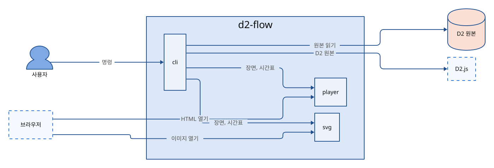

# 아키텍처

d2-flow는 D2 원본을 Hindsight 문서 그림 모양의 움직이는 그림으로 바꾸는 명령이다. 구성 요소는 셋이고, `cli`가 만든 장면과 시간표를 `player`와 `svg`가 파일 안에 담아 브라우저에서 재생한다.

## 맥락

| 외부 요소 | 종류 | 주고받는 것 |
|---|---|---|
| D2 원본 | 파일 | 그림과 흐름을 적은 `.d2` 파일 |
| D2.js | 외부 프로그램 | D2 원본, 도형 좌표, 선 경로, 원본에 적은 속성 |
| 브라우저 | 외부 프로그램 | 만든 HTML과 SVG |

## 코드 지도

| 구성 요소 | 하는 일 | 기술 | 위치 |
|---|---|---|---|
| `cli` | 원본을 읽어 D2.js로 배치하고 장면과 시간표를 만들어 HTML과 SVG로 쓰는 명령 | Node.js, `@terrastruct/d2` | `src/`에서 `player.js`, `viewer.js`, `svg.js`를 뺀 파일 |
| `player` | HTML 안에서 박자마다 선과 도형을 밝히고 점을 옮기는 재생기, 전체 화면과 확대·축소 | 브라우저 JavaScript | `src/player.js`, `src/viewer.js` |
| `svg` | 스크립트 없이 CSS keyframes와 SMIL로 움직이는 SVG | SVG, CSS | `src/svg.js` |

## 실행 흐름

### 그림 만들기

1. `cli`가 원본에서 `#@` 줄을 읽어 흐름으로 바꾼다.
2. `cli`가 원본 전체를 D2.js로 한 번 배치하고 흐름의 이름을 D2 id에 잇는다.
3. `cli`가 도형 크기와 라벨 크기를 다시 잡는 D2 줄을 원본 끝에 붙여 한 번 더 배치한다. 이 배치가 실패하면 첫 배치를 쓴다.
4. `cli`가 D2 좌표와 선 경로로 장면을 만들고 흐름을 박자별 상태로 편다.
5. `cli`가 `renderScene`으로 그린 같은 그림을 HTML과 SVG에 쓴다.

### 차트 만들기

1. `cli`가 원본에서 `#@ chart` 줄을 찾으면 D2 없이 차트 줄만 읽는다.
2. `cli`가 막대나 화살표를 그린 SVG와, 그 SVG를 담은 HTML을 쓴다.

### 재생하기

1. 브라우저가 HTML을 열면 `player`가 첫 단계의 첫 박자를 보인다.
2. `player`가 박자마다 선과 도형을 밝히고 카드 내용을 바꾸고 점을 선 위로 옮긴다.
3. 브라우저가 SVG를 열면 `svg` 안의 keyframes가 모든 단계를 이어 반복한다.

## 불변 조건

- `#@` 줄은 D2 주석이다. 같은 원본을 `d2` 명령으로도 그리게 하기 위해서다.
- `cli`는 원본 파일을 고치지 않고 배치 입력의 끝에만 줄을 붙인다. D2 오류의 줄 번호를 원본과 같게 하기 위해서다.
- 원본에 적은 `width`, `height`, `font-size`는 덮어쓰지 않는다. 사용자가 정한 크기를 잃는 일을 막기 위해서다.
- HTML과 SVG는 `renderScene` 하나가 그린 같은 그림을 쓴다. 두 결과의 모양이 달라지는 일을 막기 위해서다.
- 결과 파일은 스크립트와 스타일을 모두 안에 담는다. 파일 하나만 옮겨도 열리게 하기 위해서다.
- 화면 값은 `src/tokens.json` 토큰으로만 쓴다. 색과 크기가 파일마다 어긋나는 일을 막기 위해서다.
- `tokens.css`, `tokens.js`는 `npm run tokens`의 생성물이라 손으로 고치지 않는다. 정본과 어긋나는 일을 막기 위해서다.
- `cli`는 끝날 때 D2.js worker를 닫는다. 변환이 끝나도 프로세스가 남는 일을 막기 위해서다.

## 기술 선택

| 영역 | 선택 | 고른 이유 |
|---|---|---|
| D2 해석과 배치 | `@terrastruct/d2` | D2 문법 전체를 다시 만들지 않고 D2와 같은 결과를 얻는다. |
| 배치 엔진 | ELK | 예제에서 dagre보다 선이 도형을 덜 가로질렀다. |
| 그림 모양 | 자체 SVG | D2 SVG 대신 점 격자, container, 카드 모양을 그대로 쓴다. |
| 움직이는 SVG | CSS keyframes와 SMIL `animateMotion` | 스크립트가 막힌 GitHub 이미지에서도 움직인다. |
| 화면 값 | DTCG 형식 `tokens.json`과 생성 스크립트 | 정본 하나에서 CSS 변수와 JavaScript 값을 함께 만든다. |
| 실행 환경 | Node.js ESM, 빌드 단계 없음 | 소스 파일을 그대로 실행한다. |
